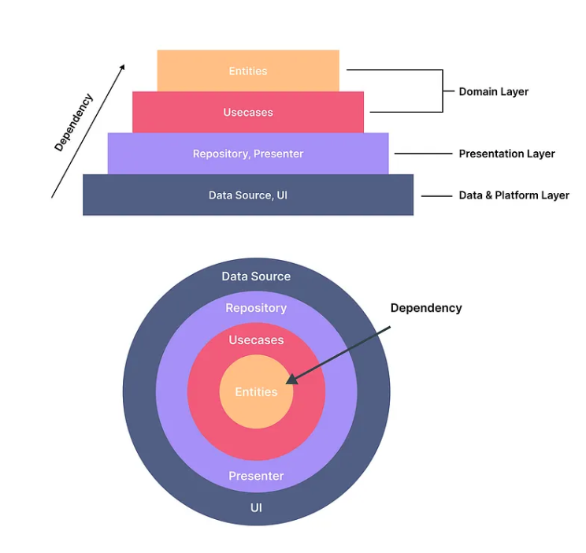
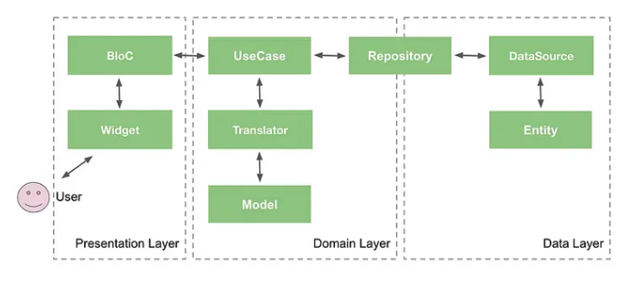

# Flutter Foundations

**Clean Architecture in Flutter | BLoC | Dio**

A production-ready Flutter project template implementing Clean Architecture, BLoC state management, Dio HTTP client, multi-flavor configuration, dependency injection, and comprehensive development tooling.



> **Architecture Overview**: This diagram illustrates the Clean Architecture layers used in this project:
> - **Pyramid View** (Top): Shows dependency direction - outer layers depend on inner layers
> - **Concentric Circles** (Bottom): Shows how dependencies flow inward toward the core (Entities)

## Features

- **Clean Architecture** with feature-first organization
- **Multi-flavor support** (Development, Staging, Production)
- **Declarative Routing** using go_router with type-safe navigation
- **Dependency Injection** using get_it and injectable
- **State Management** with flutter_bloc
- **HTTP Client** with Dio, interceptors, and error handling
- **Mock API** support for offline development
- **Code Generation** for models, DI, and mocks
- **Comprehensive testing** setup with unit, widget, and integration tests
- **Proxy support** for development environments

## Prerequisites

- Flutter SDK: 3.35.4 (managed via FVM)
- Dart SDK: >=3.9.2 <4.0.0
- FVM (Flutter Version Management)

## Getting Started

### 1. Install FVM and Flutter

```bash
# Install FVM (if not already installed)
brew install fvm

# Install Flutter 3.35.4 via FVM
fvm install 3.35.4
fvm use 3.35.4
```

### 2. Install Dependencies

```bash
fvm flutter pub get
```

### 3. Generate Code

**Important**: Generated files (*.g.dart, *.freezed.dart, *.mocks.dart, *.config.dart) are NOT committed to Git. You MUST run code generation after cloning the repository:

```bash
fvm flutter packages pub run build_runner build
```

Or to force regenerate:

```bash
fvm flutter packages pub run build_runner build --delete-conflicting-outputs
```

### 4. Run the App

```bash
# Development flavor
fvm flutter run --flavor dev --dart-define-from-file=dart_defines/dev.json

# Staging flavor
fvm flutter run --flavor stg --dart-define-from-file=dart_defines/stg.json

# Production flavor
fvm flutter run --flavor prod --dart-define-from-file=dart_defines/prod.json
```

## Project Structure

```
lib/
├── features/              # Feature modules (feature-first)
│   └── user/
│       ├── domain/        # Entities, Repository interfaces, UseCases
│       ├── data/          # DataSources, Models, Repository implementations
│       └── presentation/  # Pages, BLoC (events, states, bloc)
└── core/                  # Shared components
    ├── config/            # App configuration & flavors
    ├── router/            # GoRouter setup
    ├── network/           # Dio client, interceptors, error handling, mocks
    ├── injection/         # Dependency injection (get_it + injectable)
    ├── widgets/           # Shared widgets
    └── constants/         # App-wide constants
```

## Development Commands

### Code Generation
```bash
# Generate all code (DI, models, mocks)
fvm flutter packages pub run build_runner build

# Force regenerate
fvm flutter packages pub run build_runner build --delete-conflicting-outputs
```

### Building
```bash
# Development APK
fvm flutter build apk --flavor dev --dart-define-from-file=dart_defines/dev.json

# Staging APK
fvm flutter build apk --flavor stg --dart-define-from-file=dart_defines/stg.json

# Production APK
fvm flutter build apk --flavor prod --dart-define-from-file=dart_defines/prod.json

# Production iOS build
fvm flutter build ios --flavor prod --dart-define-from-file=dart_defines/prod.json
```

### Analysis and Testing
```bash
# Static analysis (required before commits)
fvm flutter analyze

# Run all unit tests
fvm flutter test

# Run tests with coverage
fvm flutter test --coverage

# Run a specific test file
fvm flutter test test/specific_test.dart

# Run tests for a specific feature
fvm flutter test test/features/user/

# Format code
dart format .
```

### Cleaning
```bash
# Clean and reinstall dependencies
fvm flutter clean && fvm flutter pub get
```

## Architecture

### Clean Architecture Overview

This project implements Clean Architecture principles with a clear separation of concerns across three main layers.

The architecture follows the **Dependency Rule**: source code dependencies only point inwards. Inner layers (Domain) know nothing about outer layers (Data, Presentation). This ensures:
- **Testability**: Each layer can be tested independently
- **Flexibility**: Easy to swap implementations (e.g., switch from REST API to GraphQL)
- **Maintainability**: Changes in one layer don't affect others
- **Scalability**: New features follow the same structure

### Clean Architecture Layers

#### 1. Domain Layer (Business Logic) - **Core/Inner Circle**
   - **Entities**: Pure business objects representing core concepts (e.g., `User`, `Product`)
   - **Repositories**: Abstract interfaces defining data contracts
   - **Use Cases**: Single-responsibility business rules (e.g., `GetUserUseCase`, `LoginUseCase`)
   - **Dependencies**: NONE - Completely independent, pure Dart code
   - **Location**: `lib/features/{feature}/domain/`

#### 2. Data Layer (Data Management) - **Middle Circle**
   - **Data Sources**: API clients, local databases, caching mechanisms
     - Remote: HTTP requests via Dio
     - Local: SharedPreferences, SQLite, etc.
   - **Models**: Data Transfer Objects (DTOs) with JSON serialization
     - Must have `toEntity()` methods to convert to domain entities
   - **Repository Implementations**: Concrete implementations of domain repository interfaces
     - Coordinate between data sources
     - Handle data transformation (Model → Entity)
   - **Dependencies**: Domain layer only
   - **Location**: `lib/features/{feature}/data/`

#### 3. Presentation Layer (UI) - **Outer Circle**
   - **Pages/Widgets**: Flutter UI components
   - **BLoC**: State management components
     - Events: User actions
     - States: UI states
     - BLoC: Event-to-state transformation logic
   - **Dependencies**: Domain layer (use cases) and Data layer (for DI setup)
   - **Location**: `lib/features/{feature}/presentation/`

### Data Flow



Data flows unidirectionally through the architecture layers:

**Request Flow**: UI → Event → BLoC → UseCase → Repository → DataSource → API
**Response Flow**: API → Model → Entity → UseCase → BLoC → State → UI

Key points:
- User actions trigger events in the Presentation layer
- BLoC coordinates with UseCases for business logic
- Data transformations happen at layer boundaries (Model ↔ Entity)
- State changes drive UI updates reactively

### State Management with BLoC

Uses `flutter_bloc` following the BLoC pattern:
- **Events** (`*_event.dart`): User actions or system events that trigger state changes
- **States** (`*_state.dart`): Represent different UI states (Initial, Loading, Loaded, Error)
- **BLoC** (`*_bloc.dart`): Business logic that transforms events into states
- All BLoCs registered with dependency injection using `@injectable`
- BLoCs receive dependencies (use cases) via constructor injection
- Use `BlocProvider` to provide BLoCs to widget trees
- Use `BlocBuilder` or `BlocConsumer` to rebuild UI based on state changes
- Test BLoCs using `bloc_test` package for comprehensive state verification

### Dependency Injection

- Uses `get_it` with `injectable` for DI container
- Main configuration in `core/injection/injection.dart` with `configureDependencies()` function
- Auto-generated registration in `core/injection/injection.config.dart`
- All services registered with `@Injectable()` annotations
- Repositories injected as interfaces: `@Injectable(as: Interface)`
- Singleton services use `@lazySingleton` scope
- Async initialization supported via `@preResolve` (e.g., DioClient)
- Access container globally via `getIt` variable

### Multi-Flavor Configuration

Three flavors configured via dart-define-from-file:
- **dev**: Development environment with mock API and proxy support enabled
- **stg**: Staging environment for pre-production testing
- **prod**: Production environment with optimized settings

Configuration managed by `core/config/app_config.dart`:
- `Flavor` enum: dev, stg, prod
- `AppConfig.fromEnvironment()`: Factory constructor reading from dart-define
- `AppConfig.currentFlavor`: Current flavor accessor
- `AppConfig.isProduction`: Production environment check
- `AppConfig.flavorTitle`: Human-readable flavor title for UI display
- `AppConfig.mockApiDataSource`: Boolean flag to enable mock API responses
- `AppConfig.isNeedProxy`: Boolean flag to enable proxy configuration
- All dart-define fields use snake_case: `app_name`, `base_url`, `mock_api_data_source`, `is_need_proxy`

Configuration files in `dart_defines/`:
- `dev.json` - Development settings with mocks enabled
- `stg.json` - Staging settings
- `prod.json` - Production settings

### Routing

Uses `go_router` for declarative routing:
- Centralized router configuration in `core/router/app_router.dart`
- Route constants defined in `core/router/router_constants.dart`
- Router registered with DI as `@lazySingleton`
- Custom error handling with automatic home redirect
- Use `context.go()` for navigation, `context.push()` for stacked navigation

### HTTP Client & Mock API

Located in `core/network/dio_client.dart`:
- Dio HTTP client with environment-specific base URLs from AppConfig
- Mock API adapter using `http_mock_adapter` (enabled in dev flavor)
- Mock responses configured in `core/network/mock/` directory
- System proxy detection via `native_flutter_proxy`
- Auth interceptor for request authentication (`core/network/interceptors/auth_interceptor.dart`)
- Debug logging in development mode using Dio's LogInterceptor
- Certificate validation handling for non-production environments

## Key Dependencies

### Core
- **dio** - HTTP client for API communication
- **go_router** - Declarative routing solution
- **flutter_bloc** - State management following BLoC pattern
- **get_it** + **injectable** - Dependency injection framework
- **shared_preferences** - Local key-value storage
- **flutter_inappwebview** - WebView integration for in-app browsing

### Code Generation
- **freezed** + **freezed_annotation** - Immutable data classes with unions and sealed classes
- **json_serializable** + **json_annotation** - JSON serialization/deserialization
- **injectable_generator** - DI code generation
- **build_runner** - Code generation orchestrator

### Development & Testing
- **mockito** - Mock generation for unit tests
- **bloc_test** - BLoC testing utilities
- **http_mock_adapter** - Mock HTTP responses for development
- **native_flutter_proxy** - System proxy detection and configuration

## Testing

### Testing Strategy

Comprehensive testing across all layers:

**Unit Tests:**
- **Domain Layer**: Test entities and use cases in isolation
- **Data Layer**: Test models, data sources, and repository implementations with mocks
- **Presentation Layer**: Test BLoCs using `bloc_test` package

**Widget Tests:**
- Test presentation layer pages and widgets using `flutter_test`
- Mock BLoCs and verify UI rendering for different states
- Test user interactions (button taps, form inputs)

### Test Organization
- Mirror the `lib/` structure in `test/` directory
- Use `@GenerateMocks` from `mockito` to generate mocks
- Run `build_runner` after adding new mock annotations
- Aim for high test coverage (target: >80%)

**Example Test Pattern:**
```dart
@GenerateMocks([UserRepository])
void main() {
  late MockUserRepository mockRepository;
  late GetUserUseCase useCase;

  setUp(() {
    mockRepository = MockUserRepository();
    useCase = GetUserUseCase(mockRepository);
  });

  test('should return user when repository call succeeds', () async {
    // Arrange
    when(mockRepository.getUser(any))
        .thenAnswer((_) async => User(id: '1', name: 'John'));

    // Act
    final result = await useCase(userId: '1');

    // Assert
    verify(mockRepository.getUser('1')).called(1);
    expect(result.id, '1');
    expect(result.name, 'John');
  });
}
```

### Running Tests
```bash
# All tests
fvm flutter test

# With coverage report
fvm flutter test --coverage

# Specific test file
fvm flutter test test/features/user/domain/usecase/get_user_test.dart

# Specific feature
fvm flutter test test/features/user/
```

## Contributing

### Development Guidelines

1. **Code Quality**:
   - Always run `fvm flutter analyze` before committing changes
   - Ensure all tests pass with `fvm flutter test`
   - Format code with `dart format .`

2. **Architecture**:
   - Follow Clean Architecture layer boundaries:
     - Domain layer has NO dependencies on other layers
     - Data layer depends only on domain layer
     - Presentation layer depends on domain and data layers
   - Keep feature code within its module (feature-first organization)
   - Use the existing DI container (`getIt`) rather than manual dependencies

3. **Code Generation**:
   - Regenerate code after modifying annotations: `fvm flutter packages pub run build_runner build`
   - Generated files are NOT committed to Git

4. **Naming Conventions**:
   - UpperCamelCase for types (classes, enums)
   - lowerCamelCase for members (variables, functions)
   - snake_case for dart-define configuration fields

5. **Testing**:
   - Add unit tests for new features (target: >80% coverage)
   - Use `@GenerateMocks` for generating test mocks
   - Test all layers: domain, data, and presentation

6. **Data Models**:
   - Data models should have `toEntity()` methods
   - Use `freezed` for immutable data classes
   - Use `json_serializable` for JSON conversion

7. **BLoC Pattern**:
   - BLoCs contain only presentation logic
   - Business logic belongs in use cases
   - Use `Equatable` for value equality in events, states, and entities

## Error Handling

Centralized error handling approach throughout the architecture:

1. **Custom Exceptions** (`core/network/error/exception.dart`):
   - `ApiException` - API-related errors
   - `CacheException` - Local storage errors
   - `NetworkException` - Network connectivity issues
   - Additional domain-specific exceptions

2. **Error Flow**:
   - `DioException` → `dio_error_handler.dart` → Custom Exceptions
   - Data sources catch platform errors and throw custom exceptions
   - Repositories propagate exceptions to use cases
   - Use cases return results (success/failure) to BLoCs
   - BLoCs catch exceptions and emit error states
   - UI layer displays user-friendly error messages

3. **Implementation**:
   - Data sources: Catch and throw typed exceptions
   - Repositories: Propagate exceptions without modification
   - BLoCs: Catch exceptions in event handlers, emit error states
   - UI: Listen to error states and show appropriate messages

## License

Licensed under the Apache License, Version 2.0.

- See `LICENSE` for the full text of the license.
- You may use, modify, and distribute this software under the terms of the Apache 2.0 license.
- Software is provided on an "AS IS" basis, without warranties or conditions of any kind.
